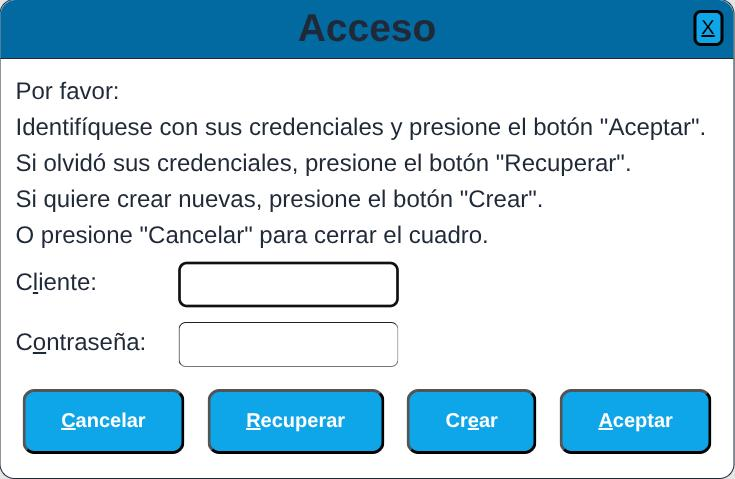
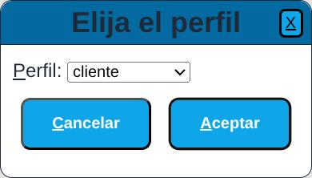
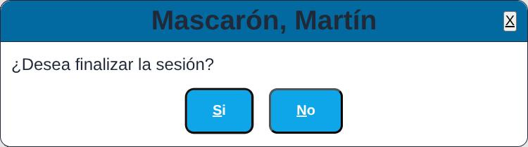
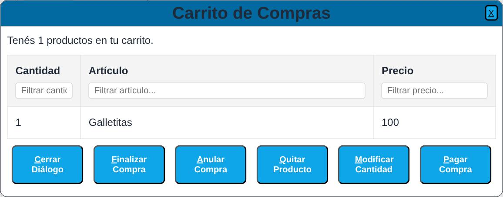

<link rel="stylesheet" href="assets/css/readme_md.css">

# Proyecto Final

<table border="1" bgcolor="#D0D0D0" cellspacing="0" cellpadding="5">
  <caption style="border-top:1px solid black; border-left:1px solid black;
   border-right:1px solid black; background-color:#d0d0d0">Información del documento</caption>
  <tbody>
    <tr>
      <td style="border:1px solid black;"><strong>Autor</strong></td>
      <td style="border:1px solid black;">Luis Fernando López</td>
    </tr>
    <tr>
      <td style="border:1px solid black;"><strong>Fecha</strong></td>
      <td style="border:1px solid black;">Martes, 23 de Junio de 2026</td>
    </tr>
    <tr>
      <td style="border:1px solid black;"><strong>Acceso</strong></td>
      <td style="border:1px solid black;"><a href="http://www.luislopez.com.ar/superACasa/index.html">Super A Casa</a></td>
    </tr>
  </tbody>
</table>

## Descripción

Se presenta la web de lo que sería un mercado con posibilidades de compra vía Internet.

## Productos

La tabla tendrá los siguientes campos:

* identi
* nombre
* descri
* precio
* promoc
* imgsrc

Todos los productos cuyo campo promoción, tienen valor no nulo, van en la
página 'index.html'.

Todos los productos cuyo campo promoción, tienen valor nulo, van en la página 'servicios/productos.html'.

Con la siguiente estructura:

~~~html

  %promoc%
  
  <h3>%nombre%</h3>
  
%descri%

  
Precio: $%precio%

  <button id="%identi%">Agregar al carrito</button>

~~~

## Modo de Uso

Tanto en la página Ofertas o index.html, como en la página Productos o productos.html, se puede observar, en la esquina superior derecha, 2 íconos, el primero con el aspecto de un engranaje, que llamaremos **Login**, y el segundo con aspecto de carrito de compras, que llamaremos simplemente **Carrito**.

### Login

Al presionarlo aparecerá el cuadro de diálogo con título acceso, que se muestra a continuación:

Permitirá el acceso a un cliente, especificando su nombre de usuario, en el cuadro de texto "Cliente", y su password, en el cuadro de diálogo "Contraseña".

Existirán algunos usuarios, que se estima, son empleados del comercio, que pueden ser administradores. Entonces, existen 2 perfiles:

* administrador
* cliente

En el caso que el usuario que se loguea, tenga un único perfil de entre los 2 seleccionados, ya quedará logueado con el perfil asignado.

En el caso que el usuario que se loguea, tenga los 2 perfiles, porque por ejemplo, es empleado del comercio y además hace sus compras en él, le aparecerá automáticamente otro diálogo, para que indique cual pefil desea utilizar en sus siguientes acciones. Este diálogo se muestra a continuación:

Si elige su perfil de administrador, podrá realizar las acciones respectivas, eligiéndolas en el diguiente diálogo:

Tanto el cliente como el administrador, luego de realizar las acciones que dieron lugar a su acceso, presionando nuevamente el botón Login, podrá desloguearse, apareciéndole el siguiente diálogo:

### Carrito

Cuando un usuario tiene el único perfil de cliente, o tiene ambos, de cliente y administrador, y estás loguedo como cliente, al presionar el carrito de compras, le aparecerá el siguiente diálogo que le permitirá realizar las acciones que necesita en el comercio:

